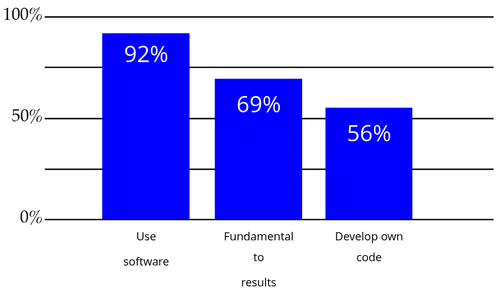
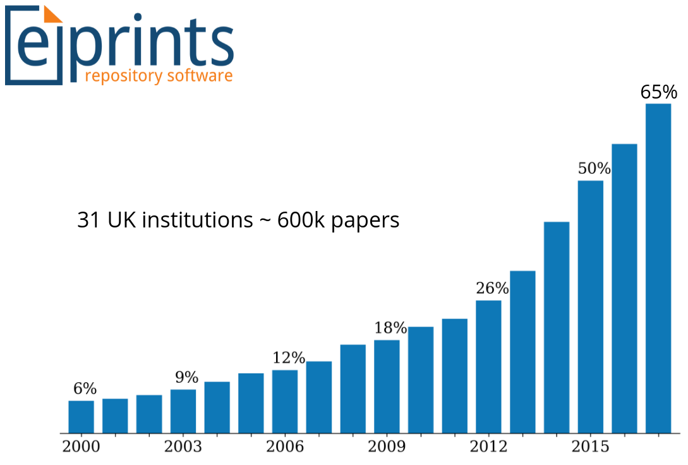
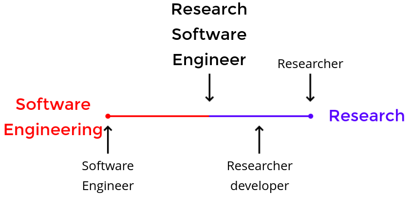
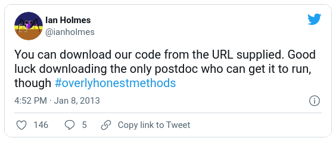

% RSE Support at Lancaster
% Robin Long
% 13/13/13

# Software sustainability:

why it's vital to research

## Why is software important?

* Research is a process
* Software is an important step in that process

<!-- 
if you cannot do research without a computer, you cannot do it without software
like lab equipment it needs to be "callibrated" and "checked"
-->

## What is Research software?

* Research software is any software that is used to generate, process
  or analyse results that you intend to use in a publication.
* It can be anything from a few lines of code written by yourself, to
  a professionally developed software package.

# How important is software?

## How many use software?

## Split by disciplin

## Papers Citing Software

# What is software engineering?

##

* Making better software for people

# What are Research Software Engineers?

##

* A Research Software Engineer (RSE) combines professional software
  engineering expertise with an intimate understanding of research.

* "RSEs collaborate with researchers to develop the software they need" - Simon Hettrick

## 

<!--
* SH slide: https://slides.com/simonhettrick/more-to-research-than-researchers#/3/4/3
-->

<!--
% PhD Comics - reuse software http://phdcomics.com/comics/archive_print.php?comicid=1689
-->

# What makes software sustainable

##

## 

* Reproducible (add definition)
* Replicable (add definition)

<!--
* Reproducible + replicable
  * Does it work on Can it be ran on a different machine? (Portable)
  * Do I need your postdoc to run it? (Documentation) %Tweet - download postdoc
  * Can I access it? (Store in repository and license)
  * Is software correct?
	* Did it get tested? Does it have tests?
-->		

# Software skill are vital

##

<!--# SH - https://slides.com/simonhettrick/software-skills-are-vital-to-research#/6-->

* Software is fundamental to all disciplines of research[^1]
* Software skills will allow you to work faster, more reliably and with less boredom
* We provide access to training and support to help you in your research

[^1]: https://slides.com/simonhettrick/software-skills-are-vital-to-research#/6

# How can RSE skills help?

##

* Efficiency
<!--* Speed up write-run-test cycle
  * Testing and Continuous Integration
  * Version Control
  * Automation -->
* Correctness
<!--  * Testing
  * Continuous -->
* Impact
<!-- * Release
  * Share
  * Package
* Documentation
-->
<!--
## What can you do?

* Change software to ensure reproducibility (and save time)
  * Move from GUI to scripts
  * Version control
  * Automate with Make
* Reduce time spent find errors
  * Continuous Testing
  * Test Driven Development
* Increase Impact and citations
  * Make it user friendly - document
  * FAIR: Findable, Accesible, Interoperable, Reusable
  * Release!!
  * Package...
  * Portable
-->

# What services do we provide?

## What do we offer?

* Support
  * Bede and HEC; small projects
* Training
* Consultancy / Advice

<!--
## Bede

* Tier 2 HPC fascility hosted by N8
* N8 supercomputer with GPU
? Add description of point of GPUs?
* Provide support for accessing/using
* Install software needed
* Advice on porting code to CUDA
* and using CUDA to enhance code

## HEC

* Lancaster's High End Computing cluster.
* Primary point of call for more power.
* Dr. Mike Pacey is the primary administrator
* Support for various computing needs
* RSE support through training courses.
-->

## Project support

* Advise and support researchers on improving code
  * Packaging code (for higher impact)
  * Documentation advice (easier use)
  * Testing
  * Refactoring
  * Performance improvements and advice on bottle necks

# Training

* What do we teach?
* Continuously evolving

## Version control

<!-- insert image -->

## Command Line

<!-- insert image -->

## HPC Skills

<!-- insert image -->

## Python 

<!-- insert image -->

## R

<!-- insert image -->

## Collaborative coding

<!-- insert image -->

## Constantly evolving

* Identify
* Understand
* Provide

<!--
% Help is on the way - Bicycle repair man
% Faulty code - Spanish inquisition (bugs) Dead parrot (does not work)
% Release your code - How not to be seen.
% Dont need every tool if you forget the purpose - machine that goes ping
-->

<!--
## Slide 1 title

Some super quickly created demo slides

* Do not need anything else than markdown
    * Slides title starts with ## (also starts a new slide)
    * Bullet points, newlines, empty lines: all standard markdown
* However, can also use other stuff, e.g.:
    * Some HTML (e.g. \<center\>)
    * When using pandoc beamer, can use latex commands (e.g. \\center, \\large, etc)\dots

## Slide 2 title

\center The slide syntax is so simple that you can quickly create a handful of slides on basically any device in any editor. E.g. on your mobile on the way to the meeting where you need the slides. Right before the meeting starts you use pandoc to create the actual slides from your source.

-->

